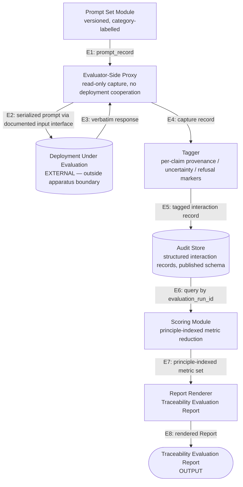
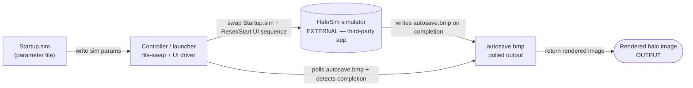

# Sundog Research Lab — IP Apparatus Graphs (Working Draft)

**Version:** 0.1
**Status:** Internal-facing working draft. Pre-counsel. Not legal advice.
**Date:** 2026-05-24
**Companion to:** `SUNDOG_IP_STRATEGY_MEMO_v0.1.md` (§4 surfaces);
`docs/501c3/HALO_HARNESS_WHITEPAPER_OUTLINE.md` (§4 architecture).
**Governance:** Subject to `SUNDOG_GOVERNANCE_POLICY_v0.1` §3 claim-tagging.
**Publication path note:** This file lives in `docs/501c3/` and **will
ship to `dist/` via `copy-site-docs.mjs`** on next build. The move from
the repository root to `docs/501c3/` was performed for housekeeping
consistency with sibling 501(c)(3) drafts (founder action,
2026-05-24). The "Internal-facing working draft" status above remains
the operative disclosure posture: this document is published in the
sense that the static site ships it, but it is **not** ratified, not
counsel-reviewed, and not yet binding on any entity. Read as a working
draft, not as a final position. Per the Governance Policy §9
corrections-and-retractions discipline, any subsequent substantive
change is recorded by amendment, not silent edit.

---

## 1. Purpose

This document is the founder's working pass at drawing the apparatus
graphs for each candidate IP surface named in §4 of the IP strategy
memo. The exercise is independent of any filing decision; per the
memo's §6 sequencing options, the graphs are *upstream* of every
ordering (file / defer / decline / pledge-and-publish).

The test applied here is the **well-formed apparatus test**: can the
mechanism be drawn with

- **named components** (each with a single, statable role),
- **named edges** (each carrying a specific, schema-able data
  structure between two components), and
- **at least one transformation** on the graph that would be
  non-obvious to a competent practitioner in the relevant field?

A mechanism that passes the test is a *filing candidate*. A mechanism
that fails it is a methodology — copyrightable, publishable, but not a
plausible patent claim under the post-*Alice* 35 U.S.C. § 101 regime
for software-adjacent inventions, where examiners increasingly require
the claimed advance to live in the apparatus's structure rather than in
the underlying idea.

This document does **not** assess novelty against prior art. That is a
prior-art-search task that follows attorney engagement (per the IP
memo §8 ninety-day plan). The non-obviousness called out in each graph
is the founder's lay reading, tagged *Hypothesised* per the Governance
Policy.

**Inventory scope.** §2.6 expands the apparatus inventory beyond the
three IP memo §4 Surfaces by mapping each demonstrated *embodiment*
of the four-step pattern named in `docs/APPLICATIONS.md` §2. This
expansion surfaces an effective **Surface D** — apparatus embodiments
in separate repositories (EyesOnly, DCgamejam2026, Money-Bags) — with
distinct chain-of-title implications recorded in §2.6.

---

## 2. Graph 1 — Surface C: Halo Traceability Harness

**Status:** First cut. *Demonstrated* that the apparatus is drawable
to claim-shape level; *Hypothesised* on each non-obviousness flag.

This is the strongest filing candidate per the IP memo §4 and, on the
apparatus test, the strongest of the three by a wide margin. The
remaining sections of the graph are unblocked once the candidate
non-obvious transformations in §2.4 are stress-tested by counsel.

### 2.1 Apparatus diagram

### 2.2 Named components

| Component | Role | Inputs | Outputs |
|-----------|------|--------|---------|
| **Prompt Set Module** | Curates and serves a versioned prompt corpus with category labels (answerable / ambiguous / out-of-corpus / adversarial / citation-trap). | None (configuration only) | `prompt_record` |
| **Evaluator-Side Proxy** | Issues prompts via the deployment's documented input interface, captures responses verbatim, performs no modification of the deployment. | `prompt_record` | `capture_record` |
| **Deployment Under Evaluation** | EXTERNAL to the apparatus boundary. Treated as a black box accessed only via documented input interfaces. | serialized prompt | verbatim response |
| **Tagger** | Applies the four-surface marker schema (per-claim provenance tags; uncertainty markers; refusal classification) to each capture. Implementation may be rule-based, classifier-based, or hybrid; output schema is invariant across implementations. | `capture_record` | `tagged_interaction_record` |
| **Audit Store** | Persists every `tagged_interaction_record` against a published schema, indexed by `evaluation_run_id`, with retention and reconstruction guarantees specified in §5.2 of the harness outline. | `tagged_interaction_record` | queryable record set |
| **Scoring Module** | Reduces an evaluation run's record set to a principle-indexed metric set keyed to Initiative §2.1 / §2.2 / §2.3 / §2.7, with status-matrix marking (Instrumented / Deferred / Paper-level-only). | record set | `principle_metric_set` |
| **Report Renderer** | Emits the Traceability Evaluation Report in a structured report format. | `principle_metric_set` | rendered Report |

### 2.3 Named edges with data structures

| Edge | From → To | Carried structure |
|------|-----------|-------------------|
| **E1** | PromptSet → Proxy | `{prompt_id, prompt_text, category_label, expected_behaviour_class}` |
| **E2** | Proxy → Deployment | serialized prompt over documented input interface (HTTP, gRPC, etc.) |
| **E3** | Deployment → Proxy | verbatim response (text + any returned metadata) |
| **E4** | Proxy → Tagger | `{prompt_record, response_record, model_version, configuration, capture_timestamp}` |
| **E5** | Tagger → AuditStore | E4 fields PLUS `{per_claim_provenance_tags[], uncertainty_markers[], refusal_classification, tagger_version, tagger_confidence_per_decision}` |
| **E6** | AuditStore → Scorer | record set filtered by `evaluation_run_id` |
| **E7** | Scorer → Renderer | `{principle_index → {metrics, status_marker, per_category_breakdown}}` |
| **E8** | Renderer → Output | rendered Traceability Evaluation Report (Markdown / PDF / JSON) |

### 2.4 Candidate non-obvious transformations — *Hypothesised*

Three transformations on the graph are flagged for attorney review. Each
is the founder's lay reading of where the apparatus does something a
competent ML-ops / RAG-eval / observability practitioner would not
trivially derive from prior art in any single overlapping literature
(per the four-literature survey in §2 of the harness outline).

**Claim Candidate A — The Tagger's per-claim four-surface schema.**

The non-obviousness lies in the *combination*: per-claim provenance
tagging (decomposing a free-text response into substantive claims and
labelling each as retrieval / recall / computation / synthesis) is
adjacent to RAG-faithfulness work but does that work at the message
level, not the claim level. Uncertainty-marker extraction exists in
calibration literature but is not paired with provenance in the same
record. Refusal classification exists in safety eval but is not paired
with either of the above in the same record. The Tagger's contribution
is the *invariant output schema* that holds across implementation
strategy (rule-based vs. classifier-based vs. hybrid) and that lets
two independently-implemented Taggers produce records that flow into
the same downstream scorer.

**Claim Candidate B — The Scorer's principle reduction.**

The non-obviousness lies in the formalisation that maps an evaluation
run's tagged-record set onto a *publicly-defined principle index*
(Initiative §2.1 / §2.2 / §2.3 / §2.7) with explicit
Instrumented / Deferred / Paper-level-only markers per principle. The
status-matrix output is what makes two Traceability Evaluation Reports
on two different deployments comparable. Existing LLM-eval frameworks
emit benchmark scores; the Scorer emits a *framework-indexed status
matrix*, which is structurally a different artifact.

**Claim Candidate C — The end-to-end evaluator-side method.**

The non-obviousness lies in the system property: the deployment never
has to cooperate (no instrumentation, no SDK install, no log access);
the apparatus produces structured, principle-indexed, independently
reproducible records purely from the deployment's documented input interface.
The combination of (i) documented-interface capture, (ii) the
Tagger's four-surface schema, (iii) the Scorer's principle-indexed
reduction, and (iv) a stable Audit Store schema enabling independent
reconstruction from persisted records and repeat evaluation when the
stated deployment version remains accessible, is the method claim
candidate.

Claim A and Claim B can plausibly stand independently (Tagger and
Scorer are separately drawable subapparatuses). Claim C is the
combined-system claim that the attorney would likely use as the
independent claim with A and B as dependent.

### 2.5 What an attorney would need to assess next

- **Prior-art search** against the four-literature survey in harness
  outline §2 (RAG faithfulness, mechanistic interpretability, LLM
  observability, hallucination detection) plus AI-safety eval
  frameworks (RSP, OpenAI preparedness, NIST AI RMF). Particular
  attention to LangSmith, Helicone, OpenLLMetry, and any
  evaluator-side proxy patents already filed.
- **Schema specificity**: how concretely does the Tagger's output
  schema need to be claimed for the schema-invariance argument to hold
  up? Too specific and a re-shaped schema designs around the claim;
  too abstract and § 101 abstract-idea rejection becomes likely.
- **Method vs. apparatus claim shape**: whether the strongest
  independent claim is the apparatus (the proxy-tagger-store-scorer
  system) or the method (the steps of capturing-tagging-storing-scoring
  in this order with these data structures). Probably both, with
  apparatus as primary independent and method as separate independent.
- **Evaluator cooperation question**: does the deployment-doesn't-need-
  to-cooperate property create a § 101 risk that the claim reads on
  ordinary API consumption? The schema-and-reduction novelty is
  load-bearing here.

### 2.6 Cross-app embodiment inventory

**Status:** First cut. *Demonstrated* by reference to canonical
`docs/APPLICATIONS.md` §2 "Shared Pattern" and §"Cross-Application
Comparison". *Hypothesised* on the per-app IP-disposition flags and
the standalone-filing-candidate ranking.

**Provenance note.** The four-step pattern (partial observability →
indirect signal → cheap transformation → bounded action with
audit) is not an aggregation imposed by external IP analysis. It is
the founder's own articulation, ratified in `docs/APPLICATIONS.md`
§2 before this IP work began. The inventory below anchors to the
canonical APPLICATIONS doc so per-app descriptions are verifiable
against the project's own published taxonomy, not re-derived by
inference.

**Disposition note — *Normative*.** A unified-engine framing
(aggregating every embodiment under a single "Indirect Signals Audit
Engine" claim) was evaluated and declined on 2026-05-24. The reasons,
recorded in the IP-strategy memory: (i) aggregation increases § 101
abstract-idea exposure rather than reducing it; (ii) the prior-art
surface explodes at the abstract tier (decades of POMDP /
observer-based control / audit-logged safety-critical literature);
(iii) chain-of-title fragments across separate-repo embodiments. The
inventory below preserves the pattern observation at the **portfolio
level** while keeping each embodiment as a potentially separable
filing candidate. This is the family-of-filings strategy.

#### Embodiment table

| App | Repo | Evidence tier (per APPLICATIONS.md) | Indirect signal | Transformation | IP disposition — *Hypothesised* |
|-----|------|------|------|------|------|
| **Sundog core** (photometric mirror alignment) | Sundog | Research result | Detector intensity + proprioception | SCAN/SEEK/TRACK extremum tracking | **Strongest standalone Surface B candidate.** Apparatus claim plausible if the SCAN/SEEK/TRACK gated pipeline has structural specificity beyond ordinary feedback control. Prior-art search vs. existing photometric / null-detector patents required. |
| **Balance** (`balance.html`) | Sundog | Operating-envelope study | Cast-shadow centroid, length, residual, velocity | SCAN/SEEK/TRACK with confidence gating; separated privileged diagnostics | **Dependent / cite-as-embodiment.** Shares apparatus with Sundog core. Useful as a "see also" embodiment showing transposition from photometric to embodied control, but not separately filable absent distinct mechanism. |
| **Three-body** (`threebody.html`) | Sundog | Operating-envelope study | Local tidal-tensor proxy, accel magnitude | Guarded TRACK on sensor-motivated instability signature | **Possible narrow standalone candidate.** The guarded-TRACK-on-instability-signature mechanism may have specificity worth its own claim. Worth a prior-art look against accelerometer-based guarded-control patents in orbital-mechanics and trajectory-correction literature. |
| **Pressure Mines** (`mines.html`) | Sundog | Operating-envelope study | Noisy pressure-field gradients + bounded scans | Confidence-gated pressure ordering with conservative threshold flagging | **Dependent / cite-as-embodiment.** Domain-specific instantiation of confidence-gating; not separately patentable absent distinct architecture. |
| **chat** (`chat.html`, "Ask Sundog") | Sundog | Instrumented prototype | Trace/ledger packet per completion | Boundary check + observable-refusal discipline | **Component of Surface C harness.** Not a separate filing. The trace-ledger boundary-discipline mechanism is part of the harness Tagger + boundary-check sub-apparatus. Disambiguate from Tagger before any filing decisions. |
| **EyesOnly / Gone Rogue** headless runner | **EyesOnly (separate repo)** | Instrumented prototype | Compressed game-state perception payload | PERCEIVE → PLAN → EXECUTE_BATCH with axis selection + stop-conditioned batches | **Separate-repo chain-of-title flag.** The runner architecture is a potentially standalone candidate but lives outside the Sundog repo's history. Inventor-of-record analysis must include EyesOnly contributors before any filing. |
| **Dungeon Gleaner** verb-field NPC | **DCgamejam2026 (separate repo)** | Product expression | Unmet-verb-need gradient over satisfier-node proximity | Greedy step toward strongest per-tick scored pull | **Separate-repo chain-of-title flag.** Verb-field diffusion is mechanism-distinct from other embodiments; could plausibly carry its own narrow claim. Jam-context contribution history requires audit. Lay priority: low (product expression tier). |
| **Money Bags** falsification apparatus | **Money-Bags (separate repo)** | Pre-registered falsification structure | Spring-graph deformation, torsion, torque, centroid travel | Graph metrics + pre-registered verdict template + bias-band threshold extraction | **Two distinct candidates inside this entry.** (i) The graph-telemetry adaptation mechanism (BloomTracker shape-spread → per-tick shape-deviation, etc.) is a Surface-B-equivalent in a sibling repo; chain-of-title flag applies. (ii) The **external-audit-finds-blind-spots methodology lesson** is highly publishable in the Surface C harness whitepaper but is *probably not patentable* — it is a process insight, not an apparatus. |
| **Isotrophy K_facet** audit chain (`isotrophy.html`) | Sundog | Theorem-adjacent audit-chain receipt | Kernel singular-value ladder, D₃ projector leakage, gap ratio | Closure-relative three-stage chain (sentinel → adaptive-floor reprocessor → bridge audit) with pre-registered guards | **Possible narrow standalone candidate.** The closure-relative audit-chain methodology — with pre-registered guard thresholds and named-quarantine discipline — is generalisable beyond any specific mathematical domain. Worth attorney attention. |

#### Explicitly NOT in the IP inventory

- **Cap-set workbench (`capset.html`).** Per `docs/APPLICATIONS.md`,
  cap-set is a *primer* for the 2016 Croot–Lev–Pach /
  Ellenberg–Gijswijt result and the 2026 OpenAI unit-distance
  disproof — not a Sundog-original mathematical claim. Including
  it in the IP inventory would be a category error by the
  founder's own discipline. Cap-set ledger material remains
  Surface A copyright-as-fixation only.
- **LAGM (Live Agentic Game Moderation).** Per
  `docs/APPLICATIONS.md`, LAGM is forward-looking application
  design, not built code. No apparatus to claim until shipped.
  Flagged for re-evaluation if LAGM moves to instrumented-prototype
  tier.
- **`playtest-agent.js` (EyesOnly UX automation).** Explicitly
  named in `docs/APPLICATIONS.md` as "automation neighbor, not
  Sundog evidence." Out of IP scope.

#### Chain-of-title flags — *Hypothesised*

Three cross-app embodiments live in separate repositories (EyesOnly,
DCgamejam2026, Money-Bags), each with its own contribution history
including agent-driven lane work (Alpha / Bravo / Echo / Foxtrot
per repo conventions). Per IP memo §7.2 "co-inventor
identification," the founder believes there are no human co-inventors
on Surfaces B and C but explicit verification is required before any
filing. The cross-repo expansion intensifies this requirement on
three axes.

**Agent-output vs. human-inventor distinction.** USPTO February 2024
guidance on AI-assisted inventions requires the human to have made a
"significant contribution" to the *conception* of the claimed
invention; AI cannot be a named inventor (per *Thaler v. Vidal*).
Agent-driven lane work in the separate repos is most plausibly
characterised as tool-use by the founder-inventor, but the
conception trace for each candidate claim needs to be articulable
per claim. Lane-handoff documents in the separate repos are part of
that trace and should be preserved.

**Contractor and partner work.** Money Bags references a "contractor
partner" who authored the Sundog-abstraction-layer adaptation and
the verification profile. Whether that contractor's contribution
rises to inventive co-conception (versus implementing the founder's
conception) requires fact-specific analysis the founder cannot
perform unilaterally. Flagged for attorney review before any
Money-Bags-derived filing.

**Jam-context contributions.** DCgamejam2026 was developed in a jam
context where contribution patterns vary. Verify the verb-field
implementation's authorship trail before any DG-derived claim.

#### Standalone-filing-candidate ranking — *Hypothesised*

If counsel-elect chooses to file beyond the harness (Surface C, the
strongest candidate per the IP memo §4 and per §2 of this document),
the lay-priority ordering for additional candidates is approximately:

1. **Isotrophy audit-chain methodology** — generalisable beyond any
   specific mathematical domain; pre-registered guards plus
   named-quarantine discipline is distinct mechanism. Sundog repo.
   No chain-of-title complication.
2. **Three-body guarded-TRACK on instability signature** — narrow,
   specific, possibly novel against existing accelerometer-control
   prior art. Sundog repo.
3. **Sundog core photometric SCAN/SEEK/TRACK pipeline** — strongest
   evidence tier (Research result) but largest prior-art surface
   against existing photometric / null-detector patents. The win
   here would be claim breadth; the risk is § 102 / § 103 prior-art
   collision.
4. **PERCEIVE / PLAN / EXECUTE_BATCH runner architecture** —
   distinct mechanism, but separate-repo chain-of-title work
   required first.
5. **Money Bags graph-telemetry adaptation** — distinct mechanism
   (graph-deformation as indirect signal), but separate-repo plus
   contractor chain-of-title complication.
6. **Dungeon Gleaner verb-field diffusion** — distinct mechanism,
   but lowest evidence tier (product expression) and separate-repo.

The harness (Surface C) remains the strongest first filing
regardless of the above. This ranking informs the *family-of-filings*
question — what to file *after* the harness — not the
single-first-filing question.

---

## 3. Graph 2 — Surface B candidate: HS-0 zero-click rendering

**Status:** Stub. Apparatus partly drawable; non-obviousness contested
on first read; needs prior-art comparison before further effort.

### 3.1 First-pass apparatus

### 3.2 First-cut assessment

The apparatus is drawable, and the named-component / named-edge
structure is clean. The contested question is whether any edge carries
a non-obvious transformation, or whether the entire mechanism is
ordinary file-swap-plus-poll automation around a third-party app.

The honest first read: the mechanism *as drawn* looks like ordinary
scripting. The non-obviousness, if any, would lie in:

- the specific Startup.sim parameterisation strategy that makes the
  swap reliable across HaloSim versions, OR
- the completion-detection heuristic on `autosave.bmp` (timestamp +
  size-stability polling), OR
- the integration of HS-0 into the broader HS-1…HS-7 generative
  pipeline (which makes the zero-click mechanism a building block of a
  larger system that *is* novel).

Recommendation: defer further apparatus-graph work on HS-0 until the
HS-1…HS-7 pipeline graph is drawn. The unit of patentability is more
plausibly the *pipeline* than the *primitive*; HS-0 alone is too close
to ordinary scripting to invest more on without prior-art comparison
against existing HaloSim batch wrappers and existing closed-app
automation patents.

---

## 4. Graph 3 — Surface B candidate: geometry-confirmation calibration

**Status:** Stub. Drawability depends on substantiation of the
calibration relationship; gate not yet cleared.

### 4.1 Pre-condition for drawing

Per the IP memo §4, the geometry-confirmation calibration is a filing
candidate **only if** the relationship between ray-count regime (B&W
~300k / colour ~3M / ~10M thumbnail) and confirmation reliability is
*substantiated by data*, not hand-tuned. If it is empirical heuristic,
no apparatus claim is available — the work is publishable as
methodology under the framework's transparency discipline, but it is
not patentable subject matter.

### 4.2 Substantiation gate — what would be needed

For the calibration relationship to be drawable as an apparatus, the
following would need to exist or be produced:

- A measurement protocol that maps ray-count to a confirmation-reliability
  metric on a reproducible test set of geometry-confirmation tasks.
- A calibrated curve (or thresholds, or regime boundaries) backed by
  the protocol's measurements.
- A documented relationship between the calibrated regime and the
  recommended-use case (geometry confirm vs. cinematic thumbnail vs.
  hero-image rendering).

If all three exist, the apparatus graph can be drawn (a calibration
module that accepts a task class and returns a ray-count
recommendation, integrated into the rendering pipeline). If they
don't, the gate is not cleared.

Recommendation: founder confirms whether the substantiation gate is
cleared before drawing this graph further. If not, the surface is
copyright-only and the work proceeds as publishable methodology.

---

## 5. What these graphs are NOT

- **Not claim drafts.** Patent claims have a specific legal shape
  (preamble, body, transition phrase, limitations) that an attorney
  will draft. The graphs are upstream of claim drafting — they make
  the attorney's job 15 minutes instead of multi-hour-interview.
- **Not prior-art surveys.** Every non-obviousness flag in §2.4 is
  *Hypothesised* pending an actual search of patent databases,
  academic literature, and existing products.
- **Not commitments to file.** Per the IP memo §6, the sequencing
  decision (file / defer / decline / pledge) remains with the founder
  and counsel-elect. The graphs preserve every option.
- **Not a substitute for the IP memo.** The memo names the strategic
  decisions (defensive vs. mixed posture, jurisdictional reach,
  ordering); the graphs feed input into those decisions, they don't
  replace them.

---

## 6. Next passes

| Pass | Trigger | Output |
|------|---------|--------|
| Harness Graph v0.2 | After USPTO Pro Bono Program or law-school clinic engagement | Schema-specificity revision; attorney-flagged edges marked |
| HS-0 → HS-1…HS-7 pipeline graph | Decision whether HS-0 is patented standalone or as part of pipeline | Pipeline-level apparatus replacing §3 stub |
| Geometry-confirmation graph | Substantiation gate cleared (or explicitly closed) | Either §4 fleshes out or §4 retires to copyright-only |
| Defensive-pledge clause draft | After counsel-elect decision on Surface C filing | New section in Governance Policy and/or this doc |

---

## 7. Claim tags on this document

- *Demonstrated*: that each surface's apparatus is drawable to at
  least the level shown here, by direct construction in §2 / §3 / §4.
- *Demonstrated*: that the Surface C apparatus passes the well-formed
  apparatus test (named components, named edges, candidate non-obvious
  transformations articulated).
- *Demonstrated*: that the four-step pattern named in §2.6 is the
  founder's own articulation in `docs/APPLICATIONS.md` §2 (verifiable
  by reading the referenced document), not a post-hoc aggregation
  imposed for IP purposes.
- *Hypothesised*: every non-obviousness flag in §2.4 (Claim
  Candidates A, B, C). These reflect the founder's lay reading and
  require attorney review against actual prior art.
- *Hypothesised*: each per-app **IP disposition flag** in the §2.6
  embodiment table. The "possible standalone candidate" markings
  reflect the founder's lay reading of mechanism distinctiveness, not
  prior-art-checked novelty.
- *Hypothesised*: the §2.6 **standalone-filing-candidate ranking**.
  Lay priority ordering only; attorney triage may substantially
  re-rank against actual prior-art surface.
- *Hypothesised*: §2.6 **chain-of-title** analysis of separate-repo
  embodiments and the USPTO 2024 AI-assisted-inventions guidance
  framing. Reflects founder's reading of public patent-bar
  commentary, not professional analysis.
- *Hypothesised*: that the **well-formed apparatus test** is a useful
  lay-level patentability filter for software-adjacent inventions
  under post-*Alice* § 101 jurisprudence. This reflects the founder's
  reading of patent-bar commentary, not professional analysis.
- *Hypothesised*: §3 first-pass assessment that HS-0 looks like
  ordinary scripting absent integration into the wider pipeline.
- *Hypothesised*: §4 framing that the geometry-confirmation
  calibration is patentable only on substantiation.
- *Normative*: §1 framing that drawing the graphs is upstream of every
  §6-of-the-IP-memo sequencing option.
- *Normative*: §2.6 **family-of-filings** disposition (preserving
  pattern repetition at the portfolio level rather than collapsing
  into a unified-engine claim). Reasons for declining the
  unified-engine framing are recorded in the IP-strategy memory.
- *Speculative*: nothing in this document.

---

*Sundog Research Lab — internal apparatus-graphs working draft, v0.1.
To be revised after counsel engagement and prior-art search.*
