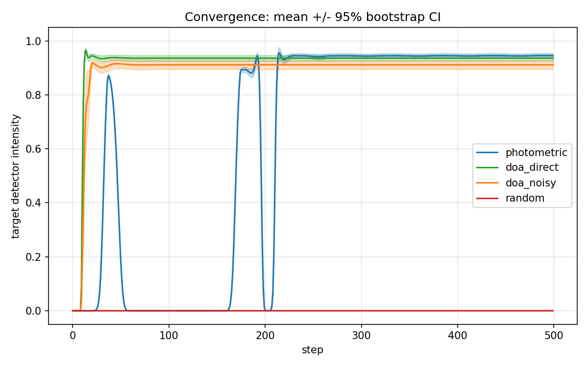
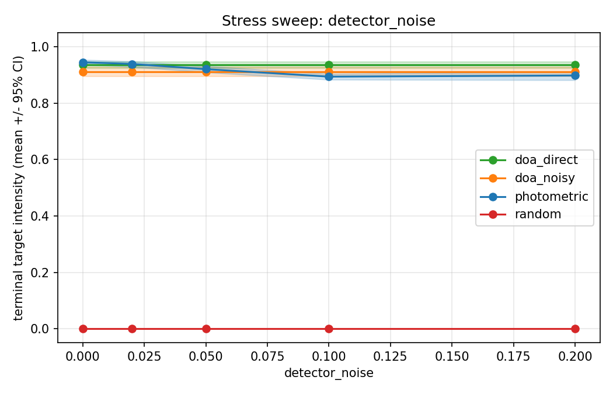
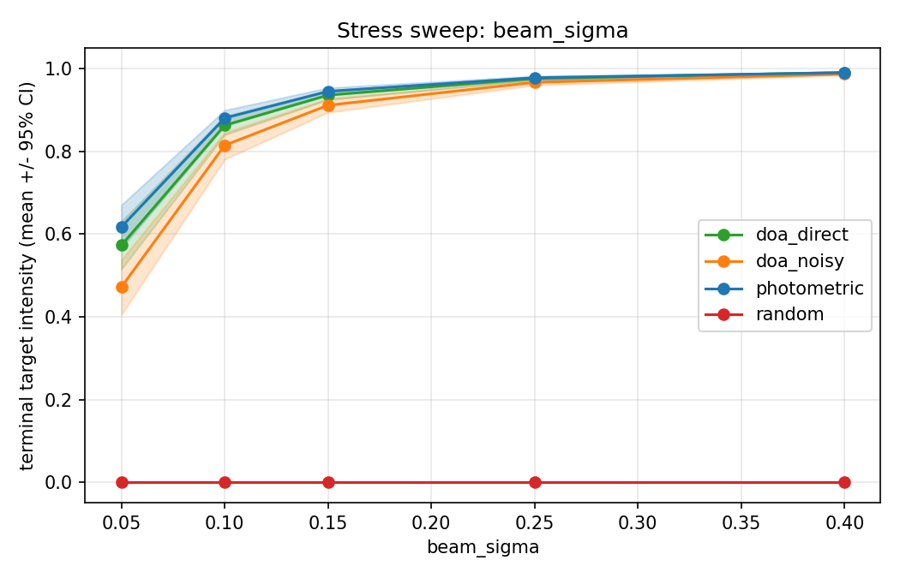
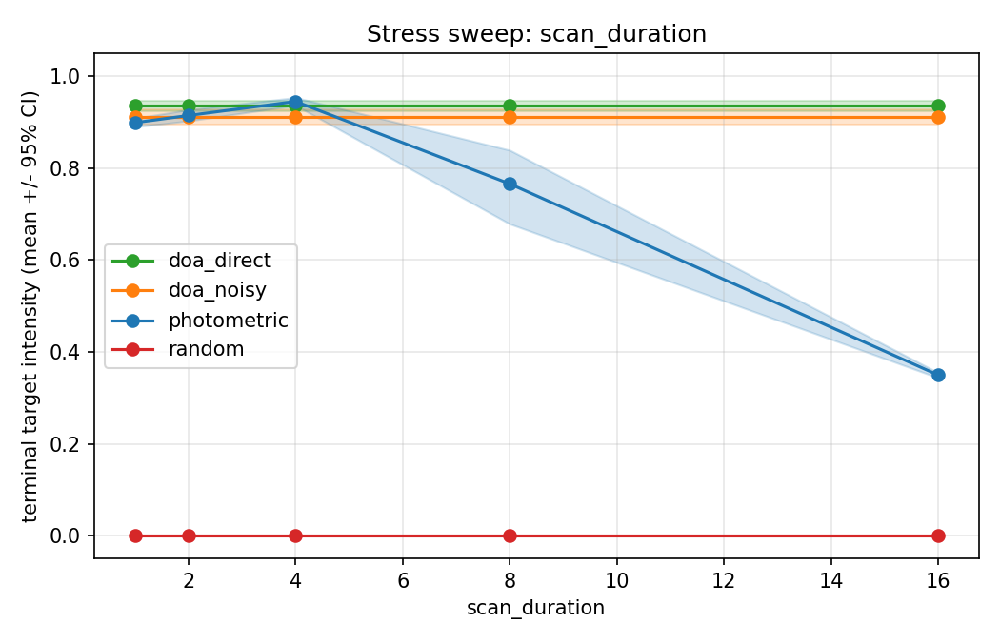
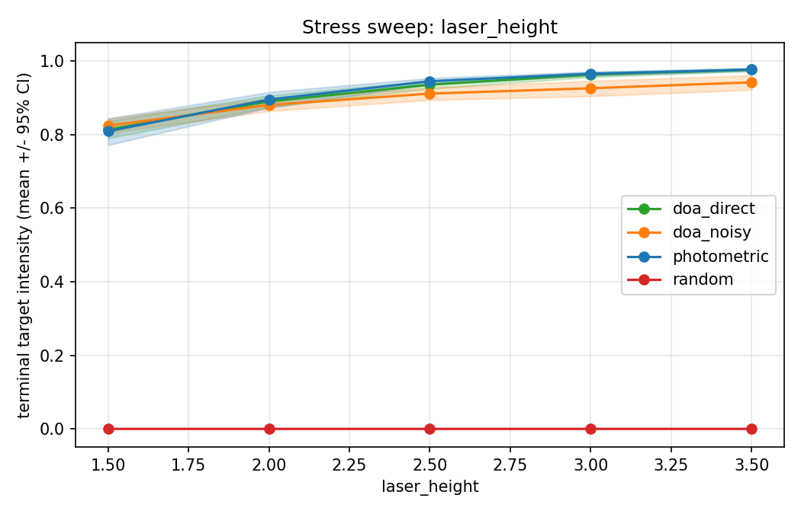
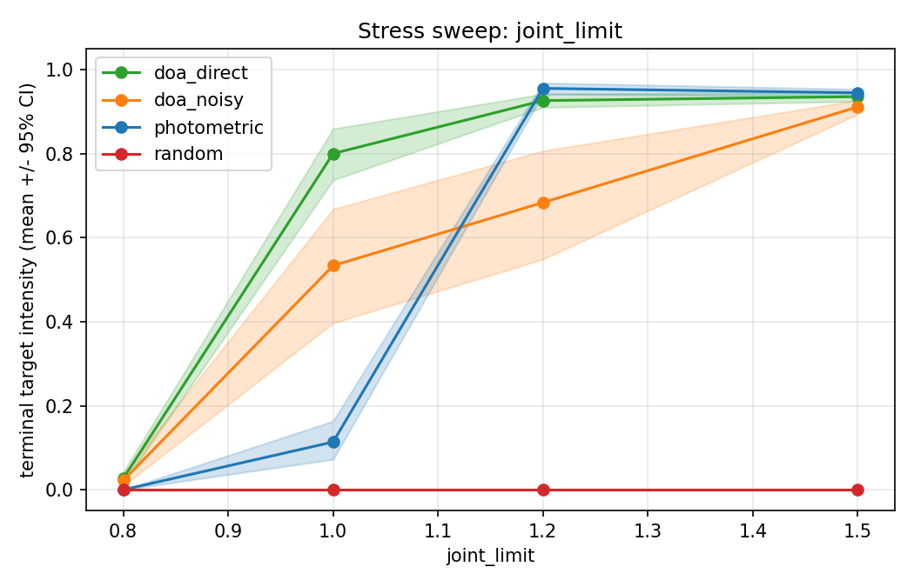

# Scan-Then-Extremum-Seek for Photometric Mirror Alignment Without Target Position Access

*Draft v1 — full prose against PAPER_OUTLINE_v0.md, tightened for RA-L 6-page budget.*

---

## Abstract

Mirror alignment as indirect control: a 2-DoF pole steers a reflected beam
from a ceiling laser onto a designated photodetector, given only an
eight-detector floor ring and joint proprioception. We propose a three-phase
scan-then-extremum-seek controller — a Lissajous joint-space scan locates
the empirical maximum, a short dwell settles the joints, and a perturb-and-
observe ESC loop refines the lock. On 30 matched MuJoCo scenes the
photometric controller reaches terminal target intensity 0.945. We do not
detect a terminal-intensity difference against an analytic oracle at 0.936
(Mann-Whitney $U = 526$, $p = 0.26$), and the controller exceeds a
noisy-oracle baseline at 0.911 ($p = 0.003$). The cost is convergence time:
188 steps vs. 11.5. A five-stressor sweep preserves the terminal-accuracy
pattern under detector noise, beam width, scan duration, and laser height, but
breaks at joint limits below 1.2 rad.

## 1. Introduction

Many alignment problems deny the controller Cartesian knowledge of the
target. Laser interferometer alignment, photonic-package beam steering,
antenna pointing under occlusion, and end-effector positioning for
marker-less soft robots share a structure: a scalar quantity is observable
(a power-meter reading, a coupling efficiency), but the target's spatial
position is not. Direct-observation control is an upper bound, not a
deployable strategy.

Extremum-seeking control [Krstic & Wang, 2000] is the classical response.
A small dither perturbs the input, demodulation recovers a gradient
estimate, and a slow loop ascends the gradient; multi-input variants use
incommensurate dithers per channel [Ariyur & Krstic, 2003]. ESC has
stability guarantees near the optimum but assumes the controller starts
inside the basin. In multi-DoF embodied tasks the basin is small and the
seed is not given.

We present a scan-then-extremum-seek architecture that handles acquisition
and refinement in one controller. A brief Lissajous scan covers the joint
workspace and records the highest target intensity observed; the carrier
jumps to that maximum and an ESC loop refines. We instantiate the
architecture on a MuJoCo mirror-alignment task and compare against an
analytic target-aware oracle, the same oracle with 5 cm of position noise,
and a random lower bound. The photometric controller shows no detected
terminal-alignment gap against the oracle at `n=30`, at the cost of ~16x
longer convergence. A five-stressor
sweep documents the operating envelope; the only failure mode is tight
joint limits, where the optimum lies outside reachability.

## 2. Related work

**Extremum-seeking control.** Krstic & Wang [2000] established ESC as a
principled controller for SISO unimodal landscapes; multi-input variants
[Ariyur & Krstic, 2003] use incommensurate dither frequencies to decouple
per-channel gradient estimates. The literature predominantly addresses
local stability around an optimum the controller is already near; global
acquisition is left to a separate seeding mechanism. Our SCAN phase is
one such mechanism, specialized to bounded workspaces.

**Indirect feedback in optics.** Lock-in detection (Dicke), Pound-Drever-
Hall, and dithered beam-pointing servos are decades-old practice
[Hobbs, 2009]. These techniques are SISO and assume coarse alignment is
already in hand. We acquire alignment from an arbitrary initial pose, and
the indirect signal is a vector of detector readings.

**Sensor-driven robotics.** Image-based visual servoing [Chaumette &
Hutchinson, 2006] closes a loop from low-dimensional features without
explicit Cartesian estimation. Our task is structurally similar but the
feature is a sparse 8-vector of photometric intensities, not invertible
to target pose without an additional optimization.

**Prior framing.** A previous paper [Hughes, 2024] proposed a "Sundog
Alignment Theorem" for indirect-feedback agent alignment with qualitative
claims about emergent resonance from shadow geometry. The present work
provides a concrete algorithmic instantiation, an oracle baseline, and a
quantitative empirical comparison.

## 3. Method

### 3.1 Task formulation

A 2-DoF pole rooted at the world origin has two perpendicular hinges at
the base ($r_x$ on world-$x$, $r_y$ on world-$y$). MuJoCo applies the
inner rotation last, so the world-frame composition is $R = R_{r_x} R_{r_y}$.
The pole has length $L = 1.2$ m; the mirrored disc at the tip has normal
aligned with the local $+z$ axis. The mirror normal in world coordinates
is

$$
n(\theta_x, \theta_y) =
\big(\sin\theta_y,\; -\sin\theta_x \cos\theta_y,\; \cos\theta_x \cos\theta_y\big),
$$

and the mirror position is $m = b + L\, n$ with base $b = (0, 0, 0.05)$ m.
Forward kinematics was validated against MuJoCo's site geometry to
within $10^{-6}$ m. A point laser sits at $\ell = (\ell_x, \ell_y, \ell_z)$
with $\ell_x, \ell_y$ randomized per scene and $\ell_z = 2.5$ m by
default. Eight photodetectors $D_0, \dots, D_7$ lie on the floor at
radius 1.2 m, evenly spaced at $\pi/4$; $D_0$ is the alignment target.

### 3.2 Optics

The incident direction is $d_{\text{in}} = (m - \ell)/\|m - \ell\|$.
Specular reflection at unit mirror normal $n$ gives

$$
d_{\text{out}} = d_{\text{in}} - 2 (d_{\text{in}} \cdot n)\, n,
$$

the floor hit follows from ray-plane intersection with $z = 0$,
$H = m + t\, d_{\text{out}}$ with $t = -m_z / d_{\text{out},z}$
(valid only for $d_{\text{out},z} < 0$), and each detector reads a
Gaussian-spot intensity

$$
I_i = \exp\!\left(-\|H - D_i\|^2 / (2\sigma^2)\right),
$$

with $\sigma = 0.15$ m by default.

### 3.3 Observation and action

The agent's per-step observation is

$$
o_t = \big(I_{0:7},\ \theta_x, \theta_y,\ \dot\theta_x, \dot\theta_y,\ \tau_x, \tau_y\big) \in \mathbb{R}^{14},
$$

with no Cartesian information about laser, mirror, floor hit, or target.
The action is a 2-vector of target joint angles in radians, clipped to
$\pm 1.45$ rad inside the physical $\pm 1.50$ rad limit. MuJoCo
position-controlled actuators with $k_p = 80$, $k_v = 8$ servo to the
target. Timestep is 0.005 s with frame skip 4 (50 Hz control).

### 3.4 Photometric controller

Three phases — SCAN, SEEK, TRACK — plus a re-acquire fallback.

**SCAN.** Lissajous trajectory in joint space:

$$
\theta_x^\star(t) = A \sin(\omega_x t), \qquad
\theta_y^\star(t) = A \sin(\omega_y t),
$$

with $A = 1.4$ rad, $\omega_x = 1.7$ rad/s, $\omega_y = 2.3$ rad/s. Run
for $T_{\text{scan}} = 4$ s (200 control steps). Maintain the running
argmax of the *measured* target intensity:

$$
(\hat\theta^\star, \hat I^\star) = \arg\max_{t \leq T_{\text{scan}}}\, I_0(t).
$$

**SEEK.** Jump to $\hat\theta^\star$ and dwell ten control steps (200 ms)
to let the joints settle and prime TRACK's DC tracker.

**TRACK.** Two sinusoidal probes at incommensurate frequencies modulate
the carrier:

$$
\theta_x^\star(t) = c_x(t) + a \sin(\Omega_x t), \qquad
\theta_y^\star(t) = c_y(t) + a \sin(\Omega_y t),
$$

with $a = 0.05$ rad, $\Omega_x = 6.0$ rad/s, $\Omega_y = 8.5$ rad/s. The
DC component is tracked by a first-order low-pass at $\alpha = 0.02$, and
the AC residual $\tilde I_0$ is demodulated against each probe:

$$
\hat g_{x,\text{inst}} = \tilde I_0 \sin(\Omega_x t), \qquad
\hat g_{y,\text{inst}} = \tilde I_0 \sin(\Omega_y t).
$$

Instantaneous gradients are low-passed at $\beta = 0.05$, and the carrier
advances along the smoothed gradient: $c[t+1] = c[t] + K\, \hat g[t]\, \Delta t$
with gain $K = 8$, $\Delta t = 0.02$ s. The commanded action is the
carrier plus the probe.

**Re-acquire.** If $I_0 < 0.05$ for 30 consecutive steps during TRACK,
return to SCAN. Probe and SCAN frequencies are hand-tuned; sensitivity on
$T_{\text{scan}}$ is in §4.6.3.

### 3.5 Baselines

**DOA-direct.** Full oracle access. At episode start the baseline solves
for joint angles that send the reflected beam to $D_0$ via 11×11 grid
search seeding Nelder-Mead refinement on the analytic intensity
$I_0(\theta_x, \theta_y)$ from §3.2 ($x_{\text{atol}} = 10^{-4}$,
$f_{\text{atol}} = 10^{-6}$). Resulting angles are clipped to the joint
limit and commanded every step. An earlier half-vector fixed-point
formulation was abandoned because joint-mirror coupling caused
oscillation between far-apart fixed points.

**DOA-noisy.** As DOA-direct but laser xy and target xy from the oracle
are corrupted by zero-mean Gaussian noise ($\sigma = 0.05$ m), drawn
once at episode start and held — a static perception error.

**Random.** Uniform random joint targets each step. Lower bound.

## 4. Experiments

### 4.1 Setup

Four conditions on the same 30 matched scenes (paired design). For seed
$s$, laser xy is drawn from $\mathcal{U}([-0.4, 0.4]^2)$ keyed by
`seed * 1_000_003 + 17`, and the initial joint perturbation from
$\mathcal{N}(0, 0.05^2 \mathbb{I}_2)$ keyed by `seed * 9_999_991 + 41`.
Each episode runs 500 steps (10 s). Headline operating point:
$\ell_z = 2.5$ m, $\sigma = 0.15$ m, $\theta_{\max} = \pm 1.5$ rad,
$T_{\text{scan}} = 4$ s — all varied independently in §4.6.

### 4.2 Metrics and statistics

**Terminal target intensity** (mean $I_0$ over the last 50 steps),
**time-to-threshold** ($I_0 > 0.9$, censored at 500), and **terminal
joint stability** (std of each joint over the last 100 steps, averaged).
Per-condition means are reported with 95% bootstrap percentile CIs (5000
resamples). Between-condition comparisons on terminal $I_0$ use a
two-sided Mann-Whitney U test.

### 4.3 Headline numbers

| Condition    | n  | Terminal $I_0$ | 95% CI         | Time-to-0.9 | n_failed |
|--------------|----|----------------|----------------|-------------|----------|
| photometric  | 30 | 0.945          | [0.936, 0.954] | 188         | 0/30     |
| doa_direct   | 30 | 0.936          | [0.925, 0.947] | 11.5        | 0/30     |
| doa_noisy    | 30 | 0.911          | [0.894, 0.927] | 14          | 4/30     |
| random       | 30 | ≈ 0            | ≈ [0, 0]       | 500 (cens.) | 30/30    |

Pairwise tests on terminal $I_0$: photometric vs. doa_direct
$U = 526$, $p = 0.264$; photometric vs. doa_noisy $U = 649$, $p = 0.003$;
photometric vs. random $p = 2 \times 10^{-11}$.

The photometric–DOA-direct comparison ($p = 0.264$) does not support a
difference in terminal alignment between full geometric oracle and the
eight-detector ring. Five centimeters of perception noise is enough to
push DOA-noisy below either ($p = 0.003$); DOA-noisy fails to cross
threshold on 4/30 seeds (13%). Photometric and DOA-direct never fail.

### 4.4 Convergence trajectories

Two intensity bumps near steps 30 and 175 mark the Lissajous trajectory
crossing the optimum during SCAN — the frequency ratio gives a beat that
revisits the optimum every ~2 s. At step 220 (200 SCAN + 10 SEEK + 10
TRACK ramp-up) photometric locks in and plateaus near 0.945, fractionally
above DOA-direct's 0.936; mechanism in §5.2.

### 4.5 Stress tests

Five perturbations swept in isolation, same 30-seed matched-scene design.

**4.5.1 Detector noise.** Additive Gaussian on agent-visible intensities
(clipped to $[0, 1]$). Ground-truth $I_0$ for the metric is read from
the unperturbed observation.

| $\sigma_n$ | photometric | doa_direct | doa_noisy |
|------------|-------------|------------|-----------|
| 0.00       | 0.945       | 0.936      | 0.911     |
| 0.02       | 0.939       | 0.936      | 0.911     |
| 0.05       | 0.921       | 0.936      | 0.911     |
| 0.10       | 0.894       | 0.936      | 0.911     |
| 0.20       | 0.898       | 0.936      | 0.911     |

DOA baselines are flat (they don't read intensities). Photometric loses
~5 points by $\sigma_n = 0.20$. The 0.10–0.20 plateau is consistent
with SCAN argmax saturation: noise floor matches the peak the agent
locks onto, so additional noise no longer biases the argmax.

**4.5.2 Beam sigma.** Gaussian-spot width on the floor.

| $\sigma$ (m) | photometric | doa_direct | doa_noisy |
|--------------|-------------|------------|-----------|
| 0.05         | 0.617       | 0.573      | 0.472     |
| 0.10         | 0.881       | 0.863      | 0.815     |
| 0.15         | 0.945       | 0.936      | 0.911     |
| 0.25         | 0.978       | 0.976      | 0.967     |
| 0.40         | 0.990       | 0.991      | 0.987     |

The photometric–DOA-direct gap widens in photometric's favour at the
sharp end ($+0.044$ at $\sigma = 0.05$ vs. $+0.009$ at baseline). At
narrow beams the analytic solver's finite Nelder-Mead tolerance maps to
non-negligible intensity error; photometric's online ESC refinement is
finer. Discussion in §5.2.

**4.5.3 Scan duration.** Photometric SCAN window. Episode budget fixed
at 10 s.

| $T_{\text{scan}}$ (s) | photometric | DOA baselines  |
|-----------------------|-------------|----------------|
| 1.0                   | 0.899       | 0.936 / 0.911  |
| 2.0                   | 0.914       | 0.936 / 0.911  |
| 4.0                   | 0.945       | 0.936 / 0.911  |
| 8.0                   | 0.766       | 0.936 / 0.911  |
| 16.0                  | 0.349       | 0.936 / 0.911  |

Inverted-U with peak at 4 s. Below 4 s SCAN under-samples; above 4 s
TRACK has insufficient remaining time (variance balloons to $\sigma =
0.225$ at $T = 8$ s vs. $0.025$ at peak). Defends the headline choice.

**4.5.4 Laser height.**

| $\ell_z$ (m) | photometric | doa_direct | doa_noisy |
|--------------|-------------|------------|-----------|
| 1.5          | 0.809       | 0.814      | 0.824     |
| 2.0          | 0.895       | 0.890      | 0.881     |
| 2.5          | 0.945       | 0.936      | 0.911     |
| 3.0          | 0.965       | 0.963      | 0.926     |
| 3.5          | 0.977       | 0.977      | 0.942     |

Photometric and DOA-direct track each other within ~1%. Lower laser
heights make geometry harder for both because reflection angles to the
1.2 m floor ring become extreme.

**4.5.5 Joint limit — the honest limitation.** Symmetric joint range
$\pm \theta_{\max}$. Photometric internal action clip is
$\min(\theta_{\max} - 0.05, 1.45)$, holding 0.05 rad inside the limit.

| $\theta_{\max}$ (rad) | photometric | doa_direct | doa_noisy |
|-----------------------|-------------|------------|-----------|
| 0.8                   | $1.7 \times 10^{-5}$ | 0.027      | 0.022     |
| 1.0                   | **0.114**   | **0.800**  | 0.534     |
| 1.2                   | 0.956       | 0.926      | 0.684     |
| 1.5                   | 0.945       | 0.936      | 0.911     |

This is the boundary the paper should own. At $\theta_{\max} \in
\{1.5, 1.2\}$ photometric matches or fractionally beats DOA-direct,
consistent with the headline. At $\theta_{\max} = 1.0$ photometric
collapses to 0.114 while DOA-direct retains 0.800 — a 7× gap.

The mechanism: when the unconstrained optimum lies outside the joint
range, DOA-direct solves on the unconstrained $[-1.5, 1.5]^2$ landscape
(its solver does not see the runtime $\theta_{\max}$ override), finds
the global optimum, and *clips* the angles to $\pm 1.0$. The clip places
the joints at the closest reachable approach to the unconstrained optimum
— a sub-optimal but informed pose. Photometric drives a Lissajous inside
the constrained workspace and locks onto whatever maximum it finds there;
at $\theta_{\max} = 1.0$ that maximum is itself low, the SCAN argmax is
sensitive to where the trajectory was when the laser position
randomized, and the across-seed mean collapses. DOA-noisy at 0.534 is
intermediate: noise sometimes pushes the analytic solve in a direction
the clip recovers from, sometimes not.

At $\theta_{\max} = 0.8$ all controllers fail; the reachable mirror-
normal cone is too narrow for the geometry, not a controller failure mode.

The asymmetry is informational: photometric has no signal that
distinguishes a low-but-true maximum from a low constrained-maximum that
should be projected outward. The oracle's clip preserves informed
direction because the direction was externally given. Inside the basin
of reachability the conditions match; once the basin narrows past the
optimum, the photometric agent loses by an order of magnitude. §6
sketches an adaptive-SCAN extension intended to detect the regime.

### 4.6 What survives

Headline equality with DOA-direct survives every tested level of
detector noise, beam sigma, laser height, and scan duration. The single
exception is the joint-limit sweep at $\theta_{\max} \leq 1.0$.

## 5. Discussion

### 5.1 Headline interpretation

A controller with no Cartesian access to the target shows no detected
terminal-alignment gap against a target-aware analytic oracle at `n=30`
($U = 526$, $p = 0.26$). The cost is convergence speed: 188 vs. 11.5 steps to
threshold, ~16x. This sharpens the standard reading of indirect feedback: the
tested cost is not terminal degradation in this operating point, but time. For
applications that can afford a few seconds of acquisition — beam
steering at startup, calibration, fixed-geometry pointing servos — the
indirect approach is effectively free in steady-state and removes the
perception-system requirement entirely.

### 5.2 The fractional photometric–DOA-direct gap

Photometric's mean (0.945) sits fractionally above DOA-direct's (0.936),
not significantly ($p = 0.26$) but consistently across stress sweeps.
The §4.5.2 beam-sigma sweep makes the source visible: the gap widens
from $+0.009$ at $\sigma = 0.15$ to $+0.044$ at $\sigma = 0.05$. Two
mechanisms contribute. The analytic solver terminates at finite
Nelder-Mead tolerance ($f_{\text{atol}} = 10^{-6}$, $x_{\text{atol}} =
10^{-4}$); at narrow beam widths the corresponding joint-angle error
maps to non-negligible intensity error. The closed-loop PD servo at
$k_p = 80$ has finite stiffness, so DOA-direct's terminal pose is the
analytic seed plus a steady-state servo error. Photometric's TRACK
refines online with ESC and is bounded by the gradient-estimator
resolution — finer in this geometry. The reading is not "photometric
beats the oracle" but that the analytic oracle is good only insofar as
its solver is precise and its servo is stiff.

### 5.3 The joint-limit asymmetry

The §4.5.5 sweep identifies the boundary of the headline result.
Inside the workspace where the optimum is reachable ($\theta_{\max} \geq
1.2$ rad), photometric matches or fractionally exceeds DOA-direct. As
the workspace narrows, DOA-direct degrades gracefully — the joint clip
projects an externally-known optimum onto the constrained workspace.
Photometric collapses — its SCAN reports a maximum, but that maximum is
a shallow constrained one. The mechanism is informational, not
computational: the photometric agent has no signal that distinguishes
a low-but-true peak from a low constrained peak that should be projected
outward. The asymmetry is sharp rather than graceful: parity inside the
basin of reachability, an order-of-magnitude loss when the basin
narrows. The result is a known boundary of the controller, not a
refutation of the headline.

## 6. Limitations and future work

**Geometry is fixed** — single laser, single target, static ring. Real
applications would have time-varying geometry; SCAN would need to
repeat on a schedule the controller does not have.

**Joint-limit cliff.** Documented in §4.5.5 and §5.3. An adaptive SCAN
that lifts amplitude in response to low intensity-during-sweep, or a
fallback that marches toward the brightest non-target detector, is the
next experiment.

**Hand-tuned parameters.** Probe and SCAN frequencies, amplitudes,
gradient gain $K$, mixing rates $\alpha, \beta$, and the re-acquire
threshold are hand-tuned. Sensitivity on $T_{\text{scan}}$ is in
§4.5.3; the others are open.

**2-DoF only.** Lissajous SCAN scales poorly with action dimensionality;
a 6-DoF arm would need a covering trajectory whose density at the
optimum is comparable across the four extra dimensions.

**Geometric optics only.** Gaussian-spot model with specular reflection;
no diffraction, polarization, spectrum, or multi-bounce. Hardware
validation will surface effects not modelled here.

**Phase-2 occlusion.** A static block between mirror and ring partially
occludes the reflected beam and breaks the assumption that the SCAN
landscape is single-peaked. We expect SCAN-SEEK-TRACK to need a
top-$k$ multi-modal argmax rule and a re-acquire that distinguishes
occlusion from drift. Design memo in `docs/PHASE2_BLOCKS_DESIGN.md`.

## 7. References

1. Krstic, M., Wang, H.-H. (2000). *Stability of extremum seeking
   feedback for general nonlinear dynamic systems.* Automatica 36(4),
   595–601.
2. Ariyur, K. B., Krstic, M. (2003). *Real-time optimization by
   extremum-seeking control.* Wiley.
3. Todorov, E., Erez, T., Tassa, Y. (2012). *MuJoCo: A physics engine
   for model-based control.* IROS.
4. Chaumette, F., Hutchinson, S. (2006). *Visual servo control I: Basic
   approaches.* IEEE RAM 13(4), 82–90.
5. Hobbs, P. C. D. (2009). *Building Electro-Optical Systems: Making It
   All Work.* Wiley, ch. 11.
6. Hughes, J. W. (2024). *The Sundog Alignment Theorem: Shadow Physics
   and Emergent Resonance for A.I.* Author: admin@stellaraqua.com.
